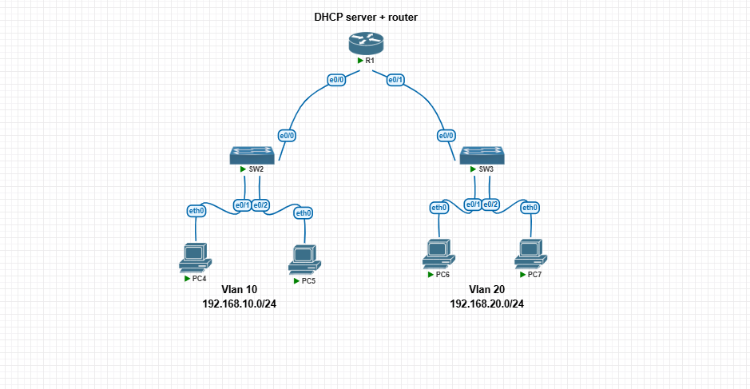

# DHCP Troubleshooting Lab — "Pool Exhausted" (Except It Wasn't)

A focused, standalone Cisco IOS lab built in **pnetlab** to reproduce and troubleshoot a real DHCP issue: a pool reporting as exhausted when it clearly had free addresses — caused by IOS's ping-before-lease conflict detection.

This lab follows up on [my earlier troubleshooting post](#) about this exact issue, this time built from scratch to walk through the full diagnosis and fix, end to end.

## 🎯 Lab Objective

Reproduce a DHCP address conflict on purpose, observe exactly how Cisco IOS detects and reports it, and walk through the diagnosis and fix — the same process used to resolve this issue in a larger enterprise lab.

## 🖧 Topology



A single router acts as both the router and centralized DHCP server for two separate VLANs:

| Node | Role |
|---|---|
| **R1** | Router + DHCP server for both VLANs |
| **SW2** | Access switch — VLAN 10 |
| **SW3** | Access switch — VLAN 20 |
| **PC4, PC5** | VLAN 10 hosts (192.168.10.0/24) |
| **PC6, PC7** | VLAN 20 hosts (192.168.20.0/24) |

## ⚙️ How It Was Built

- R1's `e0/0` and `e0/1` each act as the default gateway for one VLAN's subnet — no trunking or Router-on-a-Stick needed, since each interface serves exactly one subnet
- DHCP pools configured per VLAN, with the first 10 addresses excluded for static/infrastructure use
- All four PCs configured to pull an address via `ip dhcp`

## 🔍 The Scenario: DHCP Address Conflict

Before leasing any address, Cisco IOS **pings it first** to confirm nothing else on the network is already using it. If that ping gets a reply — even from a device that briefly held that address during earlier testing — IOS marks the address as being **in conflict** and refuses to hand it out again, without ever telling the client why.

**What this looks like from the outside:** a pool with 254 total addresses and only 1–2 leased still fails to hand out a new address, with no obvious explanation from `show ip dhcp pool` alone.

**The actual cause**, confirmed with `show ip dhcp conflict`:
```
%DHCPD-4-PING_CONFLICT: DHCP address conflict: server pinged 192.168.20.12.
```

**The fix:**
```
clear ip dhcp conflict *
```

## 📸 Screenshots

| Screenshot | Shows |
|---|---|
| [01-topology.png](topology/01-topology.png) | Lab topology — R1, two switches, four hosts across two VLANs |
| [02-dhcp-binding.png](screenshots/02-dhcp-binding.png) | `show ip dhcp binding` and `show ip dhcp pool` — normal leases across both VLANs |
| [03-dhcp-pool-vlan10.png](screenshots/03-dhcp-pool-vlan10.png) | `show ip dhcp pool vlan10` — pool detail, 254 total addresses, 2 leased |
| [04-dhcp-conflict.png](screenshots/04-dhcp-conflict.png) | `show ip dhcp conflict` — the ping-conflict entry that was silently blocking an address |

## 📁 Config

Full running-config for R1 is in [`/configs/R1-config.txt`](configs/R1-config.txt). SW2 and SW3 run default Layer 2 configuration — no VLAN or trunk configuration was needed since each switch serves a single subnet.

## 🔑 Key Takeaway

"Pool exhausted" doesn't always mean the pool is full. In a lab environment especially — where the same subnet gets reused, retested, and reconfigured constantly — conflict entries accumulate silently in the background. `show ip dhcp pool` alone won't show you this; you need `show ip dhcp conflict` to see the real cause, and `clear ip dhcp conflict *` to resolve it.

## 🧰 Tools Used

- pnetlab (Cisco IOSv router)
- SecureCRT for console access
- VPCS for end-host simulation

---

*A focused troubleshooting lab built to isolate and understand a single DHCP behavior in depth, following up on a real issue encountered while building a larger enterprise network.*
